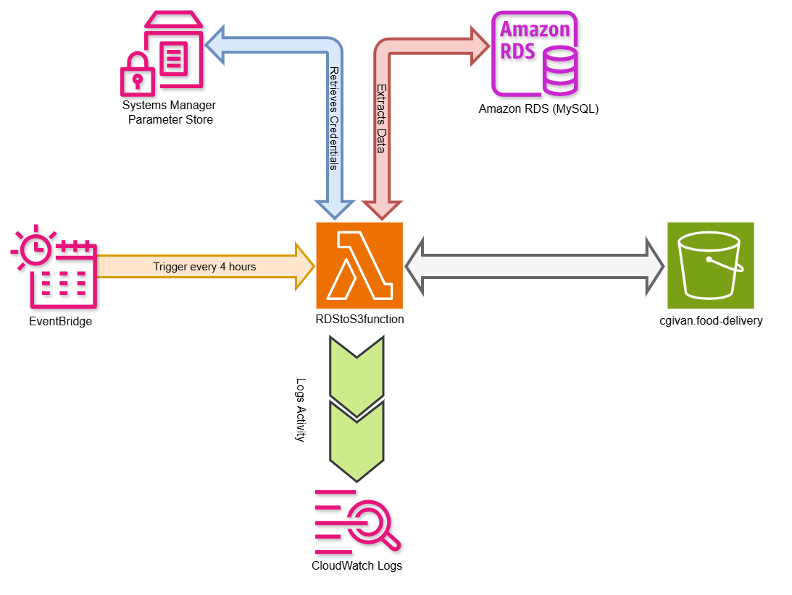
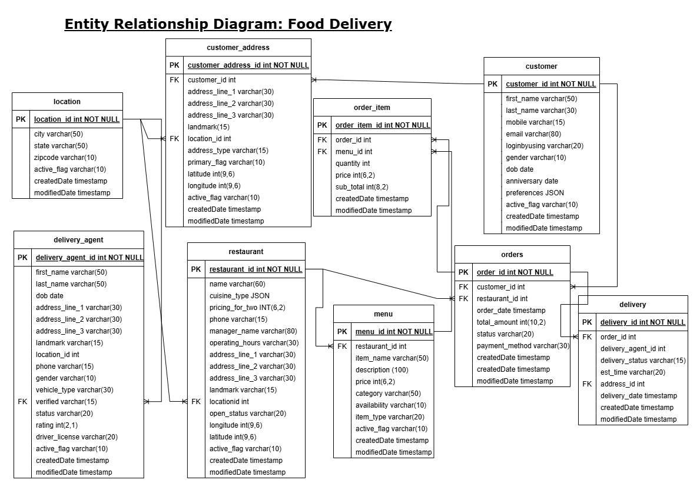

# Data Engineering Portfolio

## About Me
I’m a data engineer learning to build scalable data pipelines using AWS. I’m passionate about automating data workflows and solving real-world problems with technology, particularly in the context of operational data for a food delivery company.

## Project: Automated Data Transfer from Amazon RDS to S3 for a Food Delivery Company

### Overview
This project automates the transfer of operational data from an Amazon RDS MySQL database to an S3 bucket for a food delivery company. The `RDStoS3function` Lambda function extracts data incrementally from tables such as `location` and `customer`, processes it, and saves it as CSV files in S3. This pipeline ensures that data analysts have access to fresh data every 4 hours for monitoring business performance, such as customer growth and location-based trends. This is the first part of a larger end-to-end data engineering project that includes loading data into Snowflake and performing ETL transformations.

### Technologies Used
- **AWS Services**: AWS Lambda, Amazon RDS (MySQL), S3, Systems Manager (SSM), CloudWatch Logs (for logging)
- **Programming Language**: Python 3.11
- **Libraries**: `mysql.connector`, `pandas`, `boto3`, `logging`
- **IAM**: Configured roles and policies for Lambda to access RDS, S3, and SSM

### Architecture
The `RDStoS3function` Lambda function is triggered on a schedule (every 4 hours) via Amazon EventBridge. It retrieves RDS credentials securely from AWS Systems Manager Parameter Store, connects to an Amazon RDS MySQL database (`food_test_db`), and extracts data incrementally from tables like `location` and `customer` using SQL queries. The data is processed into CSV files using Pandas and uploaded to an S3 bucket (`test.complete.food-delivery`) under a folder structure like `{table}/csv/`. The last extracted timestamp is stored in S3 (e.g., `location/csv/last_extract.txt`) to enable incremental updates. The function logs its activity to CloudWatch Logs for monitoring and debugging.

### Architecture Diagram
  

### Key Features
- Secure retrieval of RDS credentials using AWS Systems Manager Parameter Store.
- Incremental data extraction from Amazon RDS using `modifiedDate` and `createdDate` fields to process only new or updated records.
- Data storage in S3 as CSV files with a structured folder hierarchy (`{table}/csv/`).
- Comprehensive logging to CloudWatch Logs for monitoring and troubleshooting.

### Data Used
- **Source**: Amazon RDS MySQL database (`food_test_db`).
- **Tables**: The dataset includes 9 tables: `location`,`customer`,`restaurant`,`delivery_agent`, `customer_address`,`menu`,`orders`,`order_item` and `delivery`, which were created in RDS for testing purposes.
  - `location`: Contains information about delivery locations, such as `location_id`, `city`, `state`, `createdDate`, and `modifiedDate`.
  - `customer`: Contains customer information, such as `customer_id`, `name`, `email`, `createdDate`, and `modifiedDate`.
  - `restaurant`: Contains restaurant information, such as `restaurant_id`,
  - `delivery_agent`: Contains delivery agent information, such as `delivery_agent_id`,
  - `customer_address`: Contains customer address information, such as `customer_address_id`,
  - `menu`: Contains menu information, such as `menu_id`,
  - `orders`: Contains orders information, such as `orders_id`,
  - `order_item`: Contains order items information, such as `order_item_id`,
  - `delivery`: Contains delivery information, such as `delivery_id`,
- **Data Type**: Synthetic data was used to test the system. For initial testing, a small dataset ranging from 5 to 35 rows per table was inserted, depending on the table and its business requirements.
- **Testing Process**: Additional rows were later inserted, and existing rows were updated to simulate real-world data changes. This ensured that the system could handle both inserts and updates, with each change recorded in a new CSV file for downstream consumption.
- **Format**: The data is extracted from RDS as a result of SQL queries, converted to CSV files using Pandas, and uploaded to S3 with a folder structure: `{table}/csv/` (e.g., `location/csv/location_data_20250402_120000.csv`).
- **Frequency**: Data is extracted every 4 hours, triggered by Amazon EventBridge.
- **Incremental Extraction**: Only new or updated records are extracted based on the `createdDate` and `modifiedDate` fields, using a timestamp stored in S3 (e.g., `location/csv/last_extract.txt`).

### Data Model
- **ERD**: The Entity-Relationship Diagram (ERD) below illustrates the structure of the tables in the RDS database.



### Challenges Faced
- **Challenge 1**: Ensuring secure access to RDS credentials without hardcoding them in the Lambda function.
  - **Solution**: Used AWS Systems Manager Parameter Store to securely store and retrieve the RDS username and password.
- **Challenge 2**: Handling incremental updates to avoid reprocessing the entire dataset, which could lead to performance issues.
  - **Solution**: Implemented a timestamp-based incremental extraction mechanism by storing the last extracted timestamp in S3 and using it in SQL queries.
- **Challenge 3**: Initially struggled with configuring the Lambda function to interact with multiple AWS services, such as retrieving credentials from Systems Manager Parameter Store and ensuring proper permissions to read/write to S3.
  - **Solution**: Configured the Lambda function’s IAM role with the necessary permissions (e.g., `ssm:GetParameter` for Systems Manager and `s3:GetObject`/`s3:PutObject` for S3) and tested the function with sample data to ensure proper connectivity.
- **Challenge 4**: Faced difficulties in implementing incremental data extraction to avoid reprocessing the entire dataset, which could lead to performance issues and increased costs.
  - **Solution**: Designed a timestamp-based mechanism by storing the last extracted timestamp in S3 (e.g., `location/csv/last_extract.txt`) and using it in SQL queries to extract only new or updated records. Added error handling for cases where the timestamp file was missing.

### Code Snippet
``` python

# Read the last extracted timestamp from S3
def get_last_extract_timestamp(s3_client, table):
        obj = s3_client.get_object(Bucket=TIMESTAMP_BUCKET, Key=f"{table}/csv/last_extract.txt")
        return obj['Body'].read().decode('utf-8').strip()
    
# Save the new last extracted timestamp to S3
def save_last_extract_timestamp(s3_client, timestamp, table):
        s3_client.put_object(Bucket=TIMESTAMP_BUCKET, Key=f"{table}/csv/last_extract.txt", Body=timestamp)
        
# Read the parameter values stored in system manager
def get_para(ssm_client, para_name):
        parameter = ssm_client.get_parameter(Name=para_name, WithDecryption=True)
        return parameter['Parameter']['Value']

# Connect to MySQL
conn = mysql.connector.connect(
    host="mysqldatabase.cb8ewcagm8cm.eu-north-1.rds.amazonaws.com",
    user=rds_username,  
    password=rds_password,  
    database="food_test_db"
)

# Retriving data
last_extract = get_last_extract_timestamp(s3_client, table)
query = f"""
SELECT *
FROM {table}
WHERE (modifiedDate > '{last_extract}'
    OR (modifiedDate IS NULL AND createdDate > '{last_extract}'))
"""
df = pd.read_sql(query, conn)

# Upload the CSV to S3
s3_key = f"{table}/csv/{table}_data_{timestamp}.csv"
s3_client.upload_file(local_file, TIMESTAMP_BUCKET, s3_key)


# Update the last extracted timestamp
latest_timestamp = df['modifiedDate'].fillna(df['createdDate']).max()
save_last_extract_timestamp(s3_client, str(latest_timestamp), table)
                    
```
### Python code : 
- Find the complete python code here: [rds-to-s3.py](rds-to-s3.py)

### Results and Impact
- Successfully automated the transfer of operational data (e.g., `location` and `customer` tables) from Amazon RDS to S3, enabling downstream analysis for a food delivery company.
- Provided data analysts with fresh data every 4 hours to monitor business performance, such as customer growth and location-based trends.
- Laid the foundation for the next steps in the pipeline: loading data into Snowflake and performing ETL transformations.

### Future Improvements
- Implement pagination or batch processing for large tables to handle high data volumes and avoid Lambda timeouts.
- Add data validation before uploading to S3 to ensure data quality (e.g., check for missing or invalid values).
- Use AWS Secrets Manager instead of Systems Manager Parameter Store for enhanced security of RDS credentials.

### Skills
- **Programming**: Python
- **Cloud**: AWS (Lambda, RDS, S3, Systems Manager, CloudWatch Logs, IAM)
- **Data Pipelines**: Incremental data extraction, data transfer

### Contact
- **Email**: [your-email@example.com]
- **GitHub**: [your-github-profile]
  
